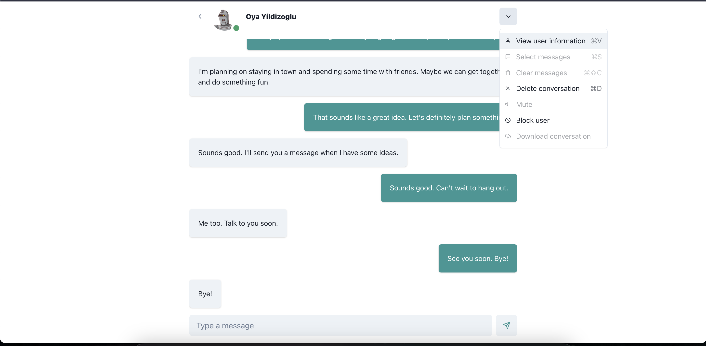

<!-- PROJECT LOGO -->
 

  

  <h3 align="center">Pychat</h3>

  

    Bringing the doge community together
     
    <a href="https://app.dodge-chat.com/"><strong>Go to app</strong></a>
     
    <i><small>Search for "Paul" to find me</small></i>
     
    <a href="https://drive.google.com/file/d/1ib8RZOTcE3wPWOesAuyDtFvPPLhAglx6/view?usp=sharing"><strong>Demo or 
tutorial</strong></a>
     
     
  

### Table of Contents

  <ol>
    <li><a href="#about-the-project">About The Project</a>
    <li><a href="#built-with">Built With</a></li>
    </li>
    <li><a href="#gettingstarted">Getting Started</a></li>
  </ol>

### About The Project

  
  
  
  
  
  
  
  
  
  
  
  

Pychat is an app to help you connect with fellow doge coin enthusiasts

### Built With

This project was built with the following tools:

- [React](https://reactjs.org/)
- [TypeScript](https://www.typescriptlang.org/)
- [Chakra UI](https://chakra-ui.com/)
- [Postgres](https://www.postgresql.org/)
- [Redis](https://redis.io/)
- [Nginx](https://www.nginx.com/)
- [Docker](https://www.docker.com/)
- [Python](https://python.org)
- [Flask](https://flask.palletsprojects.com/en/2.0.x/)
- [Celery](https://docs.celeryq.dev/en/stable/)

### Getting Started

TBD

### Deployment

* CloudFlare for DNS management.
* Hosted on my dev vm instance on Google cloud compute engine.
* Uses nginx proxy on the vm that
  - Upgrades HTTP connections to HTTPS 
  - Routes traffic to the relevant application

### Gravatar generator

https://vinicius73.github.io/gravatar-url-generator/#/
